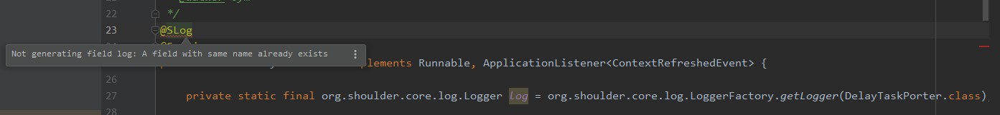

# Shoulder-Lombok

[gitee](https://gitee.com/ChinaLym/shoulder-lombokn) or [github](https://github.com/ChinaLym/shoulder-lombok)

### a [lombok](https://github.com/rzwitserloot/lombok) ext for shoulder-framework.

- add a special annotation(`@SLog`) for Simplify use `shoulder-framework`.

#### what will happen when use `@Slog` before your class ?

It just generate a line like `private static final org.shoulder.core.log.Logger log = org.shoulder.core.log.LoggerFactory.getLogger(TargetType.class);`

---

To better use it in IDEA, see lombok-intellij-plugin in [gitee](https://gitee.com/ChinaLym/lombok-intellij-plugin) or [github](https://github.com/ChinaLym/lombok-intellij-plugin)

 